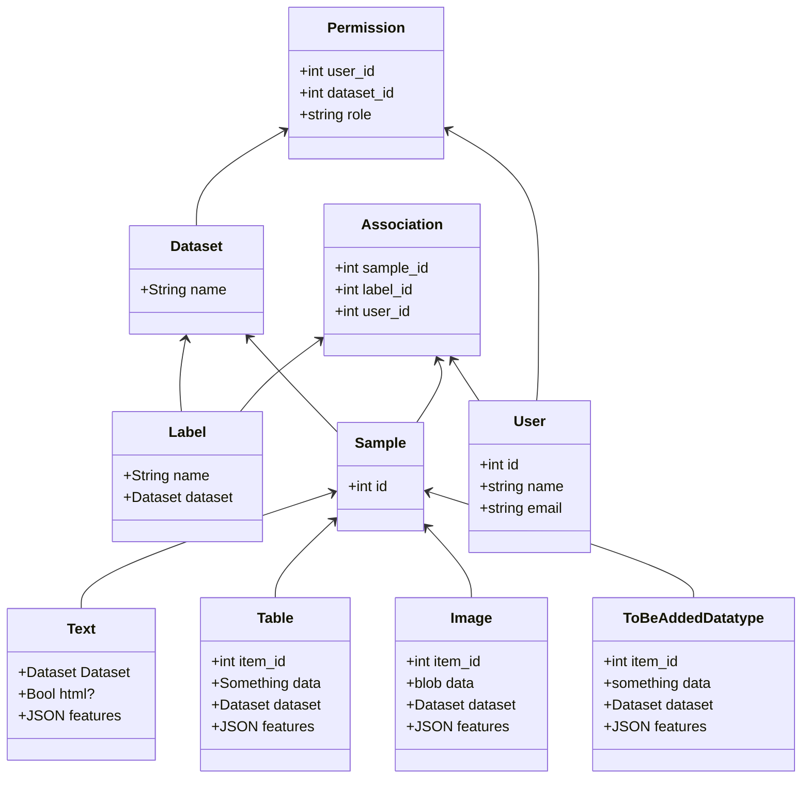

# 🦥 body Backend 

The backend features a REST API, built using the following technologies

- [FastAPI](https://fastapi.tiangolo.com) for building the API
- [Pydantic](https://pydantic-docs.helpmanual.io) for validating data
- [SQLAlchemy](https://www.sqlalchemy.org/) for working with SQLite databases

You can see the latest api spec under `localhost:8000/docs`.

## ✈️ Installation and setup 

You need the following software preinstalled:

* Python3
* [pipenv](https://pipenv.pypa.io/en/latest/install/#installing-pipenv)

Pipenv is used to resolve, lock and install all dependencies. Create and enter the virtualenv environment by running 

```bash
> pipenv install --dev
> pipenv shell
```

The backend can then be started the `flask` cli. While the `etikedi.py` could be launched with the python interpreter, the
flask cli provides the advantage of live reloading the running app when your code changes.

```bash
> cd ..   # to git root
> python -m backend
```

### 🐳 Docker

If you're working on the frontend and are only interested in getting the current state of the API up and running, Docker
makes the setup a lot easier and more deterministic. The only thing needed is running the following command in the project root.

```bash
> docker-compose up -d
```

While the first start will take some time, future runs will be a lot faster. Further docker commands to control the backend are:

```bash
> docker-compose up -d      # Starts the backend and database in the background
> docker-compose down       # Shutsdown the backend
> docker-compose down -v    # Shutsdown and removes all volumes (all persisted data), convenient for starting all over
> docker-compose logs -f    # Shows the logs and follows them
> docker-compose ps         # Check if the container is running
> docker-compose build      # Force a rebuilding the images
```


### 🛠 PyCharm Setup

The project does not require `PyCharm` by any means. Those are just special instructions if you are using `PyCharm`. If you are
developing using something else, feel free to skip this section.

By default, `PyCharm` will not recognise the installed dependencies. In order to make auto complete work,
you have to point `PyCharm` to the virtual environment that `pipenv` created. You can get the path by running:

```bash
> pipenv --venv
/Users/your_name/.local/share/virtualenvs/backend-toK29_84
```

In `PyCharm`, go to the [Interpreter Settings to create a new Python interpreter](https://www.jetbrains.com/help/pycharm/configuring-python-interpreter.html#add-existing-interpreter).
Follow these instructions and insert the path obtained in the previous step. You should then see all dependencies listed
and notice that the autocompletion works from now on.

While running the app using the command line would be perfectly fine, it is advisable to use the dedicated `Flask Run Configuration`,
as it allows to easily use the integrated debugger. 


## 💽 Data 

The application contains some sample data. Upon startup, it contains the following users for testing

Admin
- Username: ernst_haft
- Password: adminadmin

Worker1
- Username: anna_lühse
- Password: very_secret

Worker2
- Username: mario_nette
- Password: very_secret


## ➕➕ Adding datasets

Datasets can come in any form imaginable. In order to import them, the user has to convert it into the one format that Etikedi understands and accepts. Each dataset has to be uploaded as two separate files, one containing the raw data that should be displayed to the person labeling and another containing the features used by the classifier.

Former is uploaded as a zip. Each file should be named `{id}.raw` and could contain a valid png photo, an html table or simple text.

Latter has to be given as a csv file with at least two columns. One column has to be named `ID` and its values have to correspond to the ids given in the already mentioned zip file. The second requried column is `LABEL` and should contain, well, the labels that can be associated to each sample. Please note that Etikedi will present the user with only the set of labels you have given in this column. This requirement exists because when the active learning code starts, it has to know each label and at least one sample for each. All other columns are the features and can be named whatever and contain arbitrary data.


## 🖥 Code overview

`etikedi.py` is the entrypoint to the application, starts the backend and ties everything together.

In your editor you can set as code formatter [black](https://github.com/psf/black).

### Models



### REST API

To communicate with the frontend the backend provides a REST API.
In `etikedi.py` the endpoints are defined, which in turn refer to the specified endpoints in the model.
To test the Api without the frontend you can use e.g. curl:

```bash
> curl http://127.0.0.1:5000/api/resumees/1
```
