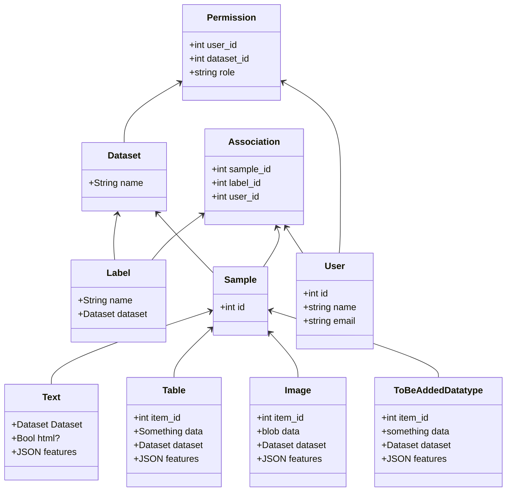

# 🦥 Aergia Backend 

The backend features a REST API, built using the following technologies

- [Flask](https://flask.palletsprojects.com/), a lightweight web framework 
- [Flask-RESTful](https://flask-restful.readthedocs.io/) for building the REST interface
- [FlaskSQLAlchemy](https://flask-sqlalchemy.palletsprojects.com/en/2.x/) Tiny wrapper around the [SQLAlchemy ORM](https://docs.sqlalchemy.org/en/13/orm/tutorial.html)
- Sqlite for storing the data in `test.db`


## ✈️ Installation and setup 

You need the following software preinstalled:

* Python3
* [pipenv](https://pipenv.pypa.io/en/latest/install/#installing-pipenv)

Pipenv is used to resolve, lock and install all dependencies. Create and enter the virtualenv environment by running 

```bash
> pipenv install --dev
> pipenv shell
```

The backend can then be started the `flask` cli. While the `aergia.py` could be launched with the python interpreter, the
flask cli provides the advantage of live reloading the running app when your code changes.

```bash
> export FLASK_APP=aergia.py
> export FLASK_ENV=development
> python aergia.py

# or as a oneliner
> FLASK_APP=aergia.py FLASK_ENV=development flask run
```

### 🐳 Docker

If your working on the frontend and are only interested in getting the current state of the API up and running, Docker
makes the setup a lot easier and more deterministic. The only thing needed is running the following command in the project root.

```bash
> docker-compose up -d backend
```

While the first start will take some time, future runs will be a lot faster. Further docker commands to control the backend are:

```
> docker-compose up -d      # Would start the frontend too
> docker-compose down       # Shutsdown the backend
> docker-compose down -v    # Shutsdown and removes all volumes (all persisted data), convenient for starting all over
> docker-compose logs -f    # Shows the logs of the backend
> docker-compose ps         # Check if the container is running
> docker-compose build      # Force a rebuilding the images
```


### 🛠 PyCharm Setup

The project does not require `PyCharm` by any means. Those are just special instructions if you are using `PyCharm`. If you are
developing using something else, feel free to skip this section.

By default, `PyCharm` will not recognise the installed dependencies. In order to make auto complete work,
you have to point `PyCharm` to the virtual environment that `pipenv` created. You can get the path by running:

```bash
> pipenv --venv
/Users/your_name/.local/share/virtualenvs/backend-toK29_84
```

In `PyCharm`, go to the [Interpreter Settings to create a new Python interpreter](https://www.jetbrains.com/help/pycharm/configuring-python-interpreter.html#add-existing-interpreter).
Follow these instructions and insert the path obtained in the previous step. You should then see all dependencies listed
and notice that the autocompletion works from now on.

While running the app using the command line would be perfectly fine, it is advisable to use the dedicated `Flask Run Configuration`,
as it allows to easily use the integrated debugger. 


## 💽 Data 

The application contains some sample data. Upon startup, it contains the following users for testing

Admin
- Username: ernst_haft
- Password: adminadmin

Worker1
- Username: anna_lühse
- Password: very_secret

Worker2
- Username: mario_nette
- Password: very_secret


## 🖥 Code overview

`aergia.py` is the entrypoint to the application, starts the backend and ties everything together.

In your editor you can set as code formatter [black](https://github.com/psf/black).

### Models




### REST API

To communicate with the frontend the backend provides a REST API.
In `aergia.py` the endpoints are defined, which in turn refer to the specified endpoints in the model.
To test the Api without the frontend you can use e.g. curl:

```bash
> curl http://127.0.0.1:5000/api/resumees/1
```

### Database Setup

In order to create the SQLite database and the needed tables, you have to use the `python` interpreter

```python
>>> from backend.aergia import db
>>> db.create_all()

# And to drop all tables
>>> db.drop_all()
```

### example_active_learning_run.py

In this file we've shown how to start the Active Learning Module for the basic iris data set.
This code needs to be combined with the back end Flask code.
For now an example oracle `aergia_oracle.py` is used, which just randomly guesses the correct label.
Instead the user input from the frontend should be used of course.