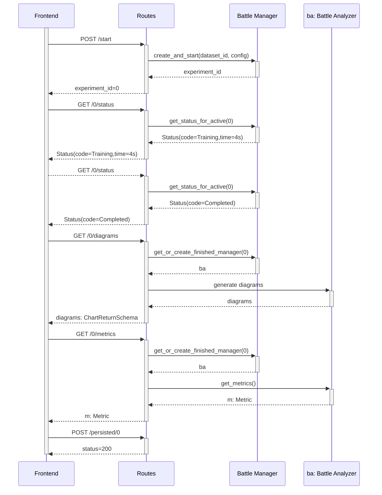
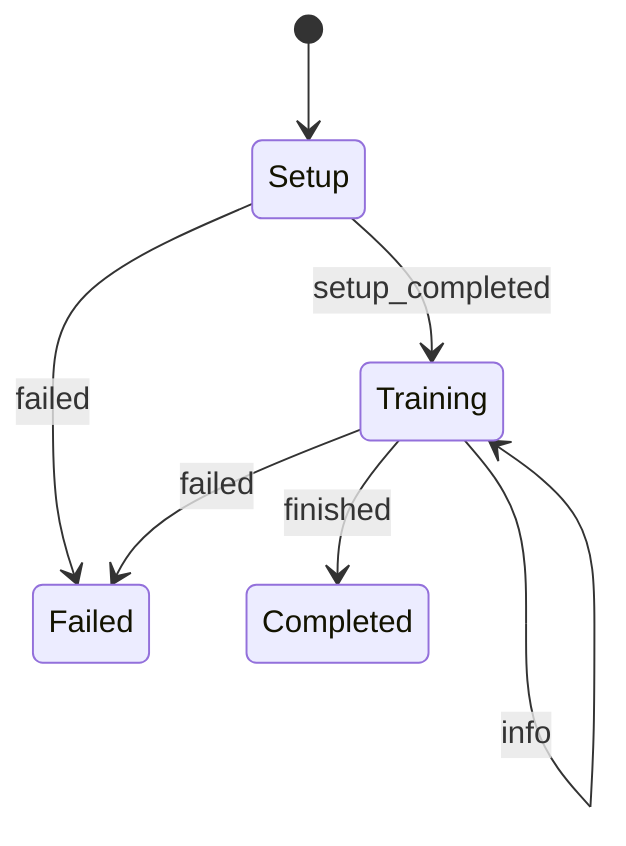

# Battle

Compare two active learning strategies (implemented by [alipy](https://github.com/NUAA-AL/ALiPy)) and visualize ([altair](https://github.com/altair-viz/altair)) the
learning process with numerous charts. The strategies can be highly configured and combined with multiple sklearn al-model.

## Full execution

This is an example on how a successfully run of a battle could look like.



- Calling `/metrics / persisted / diagrams` before an experiment is finished will trigger a response with status = 400.
    - However it is not mandatory to call `/status`
- the `experiment_id` is returned in the response body as plain number
- `Battle Manager` is a singleton with class variables / methods
- The `Battle Analyser` is only created once and then stored in the `Battle Manager`

### Internal execution

Every fastapi-call is executed as a coroutine. For both experiments some common setup-code has to be executed, this is
done with an extra process (`run_in_executor`). Thus allowing to return the network call with the new `experiment_id`.
The results of the preparation-process are awaited with an `asyncio` callback. Only after this callback is scheduled the
main experiments will be started (`multiprocessing`) in parallel.

````mermaid
sequenceDiagram
    participant R as battle: Router
    participant M as Battle Manager
    participant H as holder: Active Battle Holder
    participant P as Preparation Process
    participant E0 as e0: ExperimentProcess
    participant E1 as e1: ExperimentProcess
    participant A as ba: Battle Analyzer
    
    R ->>+ M: create_and_start
    M ->> M: validate_else_throw()
    M ->> M: next_experiment_id()
    M ->> H: init(experiment_id, dataset_id, config)
    H -)+ P: prepare_experiment(dataset_id, config)
    H -->> M: holder
    M -->>- R: experiment_id
    P --)- H: sample_df, cb_raster
    H ->>+ H: _start_experiments()
    H ->>+ E0: init(0, dataset_id, sample_df, config, queue, cb_ raster)
    E0 -->>- H: e0
    H ->>+ E1: init(1, dataset_id, sample_df, config, queue, cb_ raster)
    E1 -->>- H: e1
    H -)+ E0: start()
    H -)+ E1: start()
    deactivate H
    Note over H,E1: Processes report state over queues
    E0 --)- H: result
    activate H
    E1 --)- H: result
    deactivate H
    R ->>+ M: get_or_create_finished_manager
    M ->> M: assert_experiment_finished()
    M ->>+ A: init(dataset_id, config, cb_sample, result_one, result_two)
    A -->>- M: ba
    M ->> H: del
    M -->>- R: ba
````

### States of experiments

Each _battle_ consists of the two approaches which should be compared. Those approaches will be called _experiments_.
`TODO:` rename `experiment_id` to `battle_id`
The experiments are executed asynchronously in another process and follow the sate-chart below. The transitions describe
events which the experiments sends back over a queue.



## Charts

Plotting is realised with altair were all charts are rendered in the backend and transferred as json. Based on the size
of the result-data either `UrlData` or` pd.Dataframe`'s are given as datasource for the charts. As the chart-generation
still takes some time most of them are executed in parallel.

#### Learning Curve

Accuracy for both experiments over all iterations.

- 2D line-chart
- X Axis: Iteration
- Y Axis: Accuracy

#### Data-MaP

An overview over how certain and accurate the test samples were classified. This plot may give a good view on
hard-to-learn

- 2D scatter plot
- Color: Percentage of correctness
- X Axis :Variability
- Y Axis : Confidence
- Points: test samples
    - For every point calculate over the last 10 iterations
        - mean of confidence
        - mean of variability in predicted label
        - mean of correctly labeled

#### Vector Space

- Transform high dimensional feature-space into 2D
    - Manual selection (part of the `PlottingConfig`)
    - PCA
- 2D scatter plot
- X Axis: Feature 1
- Y Axis: Feature 2
- Points: test samples
- Color: Labeled | Unlabeled | Selected $ \in \mathcal U_q$
    - highlight $\mathcal U_q$

#### Classification Boundaries

Extra set of samples are generated over the feature-domains. They get classified by the normal model in each iteration.
For the visualization the dimensions are reduced to two features. The plot shows an approximation on how and which areas
of the feature-space are classified by the model.

- Binned heat-map
- X Axis: Feature 1
- Y Axis: Feature 2

- Color: predicted class
    - Alpha: certainty

#### Confidence Histogram

For every classified sample the highest confidence is selected (from confidence score per class). Those
confidence-scores are associated by occurrence over all classified samples (from this iteration).

- Binned bar-chart
- X Axis: Confidence [0..1]
- Y Axis: Occurrence of confidence (Positive integer)

